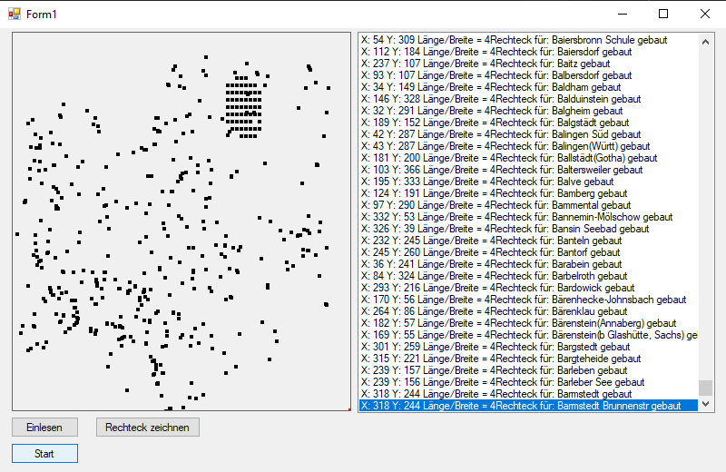

# Task:

## Import CSV file containing all german railway stations 
## Draw stations and mark central stations 

[jump to form](https://github.com/Computational-Design-Consulting/CSharp-Collection/blob/mainCDC/Solving%20Tasks/BahnhoefeZeichenen/AufgabenW6D1%20BahnhoefeZeichenen1/Form1.cs)

